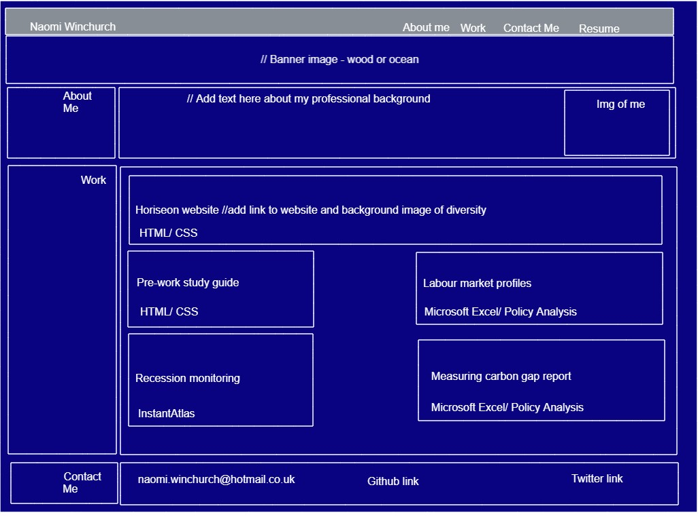
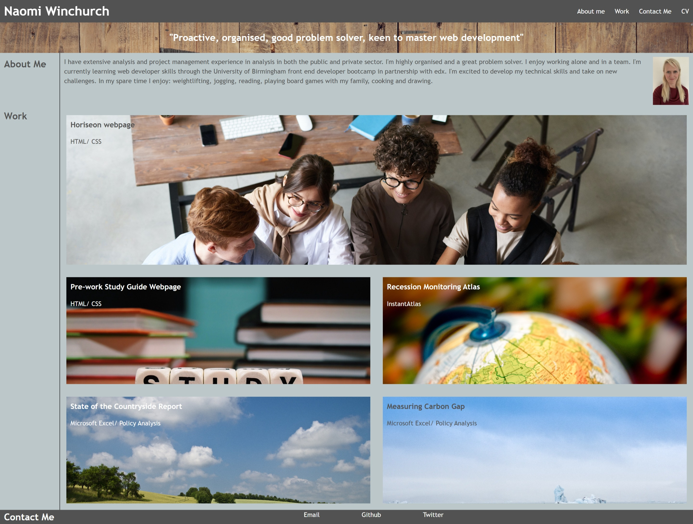
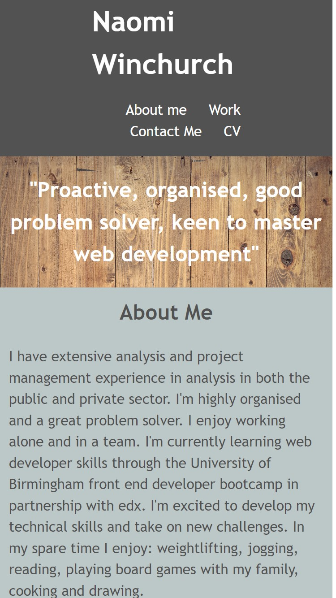

# 02-building-portfolio-website

## Description

This repository contains all files relating to the week 2 frontend coding bootcamp challenge of creating a portfolio webpage. I was motivated to build this webpage to showcase and share projects I'd worked on. I wanted to set this up to demonstrate my projects to potential employers, and others working in web development. This webpage provides information on my experience, skills and contact details in a central place. Creating this webpage enabled me to develop my CSS and HTML skills. In particular, I learnt how to apply flexbox and media queries to take into account different screen sizes.

## Installation

N/A

## Usage

This website has been set up to showcase my portfolio as it develops over time. This would be useful for potential employers or anyone interested in learning more about my experience. The website has been developed to display accurately on mobile phones and desktops. Please see below for a screenshot of my wire frame.

Please see below for a screenshot of the website in desktop view.

Please see below for a screenshot of the website in mobile view.

Please refer to the link below to access the webpage.

[Portfolio website](https://nwinch1512.github.io/02-building-portfolio-website/ "Visit Naomi Winchurch portfolio website")

## License

Please refer to the LICENSE in the repo.
